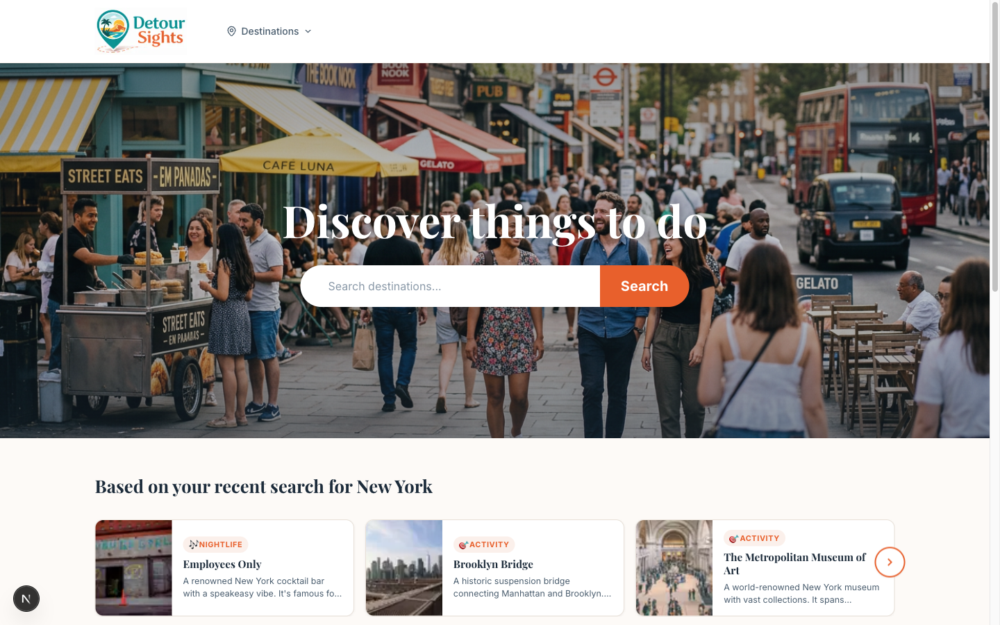
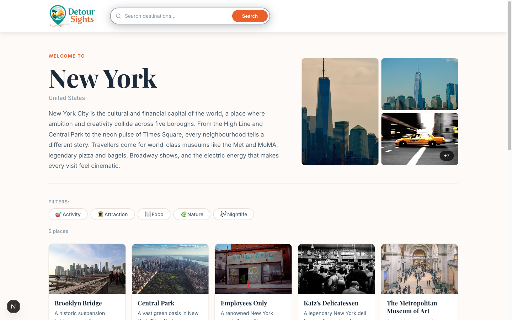

# Detour Sights (https://www.detoursights.com")

A travel discovery web app for finding things to do, places to eat, and hidden gems at destinations around the world.

---

## Screenshots

| Home | Destination |
|---|---|
|  |  |

---

## Description

Detour Sights helps travelers explore destinations and discover places worth visiting. Users can search for any destination, browse curated places within it, and filter by category (food, attractions, nightlife, shopping, nature, and more). Each destination page surfaces a photo gallery, traveler reviews aggregated into a "Why Visit" summary, and a map of nearby destinations to explore next. Place detail pages include maps, contact details, price range, and visitor reviews.

The app tracks recently visited destinations via a cookie and uses that to surface personalized place suggestions on the home page — showing relevant places from wherever the user last explored.

---

## Tech Stack

| Layer | Technology |
|---|---|
| **Framework** | Next.js 14 (App Router) |
| **Language** | JavaScript (no TypeScript) |
| **Database** | PostgreSQL |
| **ORM** | Prisma 5 |
| **Styling** | CSS Modules + CSS custom properties |
| **Images** | Cloudinary (URLs stored in DB, served via `next/image`) |
| **Fonts** | Playfair Display + Inter via `next/font/google` |
| **Maps** | Google Maps Embed API |
| **Responsive** | `react-responsive` with hydration-safe hooks, `postcss-custom-media` for named breakpoints |
| **Icons** | Lucide React |
| **Deployment** | Vercel |

### Breakpoints

Defined as `@custom-media` in `app/globals.css` and mirrored as JS hooks in `lib/media-queries.js`:

| Name | Max-width | Targets |
|---|---|---|
| `--mobile` | 479px | Phones |
| `--lgMobile` | 559px | Large phones |
| `--tablet` | 767px | Phones + portrait tablets |
| `--laptop` | 1023px | Tablets landscape + small laptops |

---

## Features

### Destination Page (`/[destinationSlug]`)

Each destination has a dedicated page with:

- **Header** — Destination name, country, and description alongside a photo gallery thumbnail grid. Clicking the gallery opens a full-screen lightbox with keyboard navigation and touch swipe support.
- **Places filter** — Category pills (Attraction, Food, Nightlife, etc.) that filter the places grid in real time. Multiple categories can be selected simultaneously; an active filter count and a clear button are shown when filters are applied.
- **Places grid** — Responsive card grid showing all places for the destination, each with a cover image, name, description excerpt, category tags, and price range.
- **Why Visit** — A curated summary section that pulls from real visitor reviews to answer why the destination is worth the trip.
- **Nearby Destinations** — A paginated carousel of geographically close destinations, sorted by distance in miles, letting users hop to the next place to explore.

### Personalized Suggestions

On the home page, a "Based on your recent search for X" section surfaces up to 10 places from the last destination the user viewed. This is powered by a `recentDestination` cookie set when any destination page is visited. The section is a server component that reads the cookie at render time — no client-side fetch required. If no cookie exists or the destination has no places, the section is hidden entirely.

The suggestions carousel adapts its column count by viewport: 3 cards on desktop, 2 on laptop and tablet, 1 on smaller phones.

---

## Project Structure

```
app/
  layout.jsx                        # Root layout — fonts, Header, Footer
  globals.css                       # Design tokens + named breakpoints
  HomePage.jsx / page.jsx           # Home — hero search, featured carousels, personalized suggestions
  [destinationSlug]/
    DestinationPage.jsx / page.jsx  # Destination page
    [placeSlug]/
      PlacePage.jsx / page.jsx      # Place detail page
  api/
    nearby/                         # Nearby destinations/places API route
    search/                         # Destination search API route
    why-visit/                      # AI-generated Why Visit summary route
components/                         # Shared UI components
lib/
  prisma.js                         # Prisma client singleton
  media-queries.js                  # Hydration-safe responsive hooks
  recentDestination.js              # Cookie helpers for personalized suggestions
prisma/
  schema.prisma                     # DB schema
  seed.js                           # Seed data (93 destinations, ~94 places)
```

---

## Getting Started

```bash
npm install
npm run db:migrate      # Run Prisma migrations
npm run db:seed         # Seed the database
npm run dev             # Start dev server at localhost:3000
```

### Common Commands

```bash
npm run db:studio       # Open Prisma Studio (visual DB browser)
npm run db:generate     # Regenerate Prisma client after schema changes
npm run build           # Production build
```
